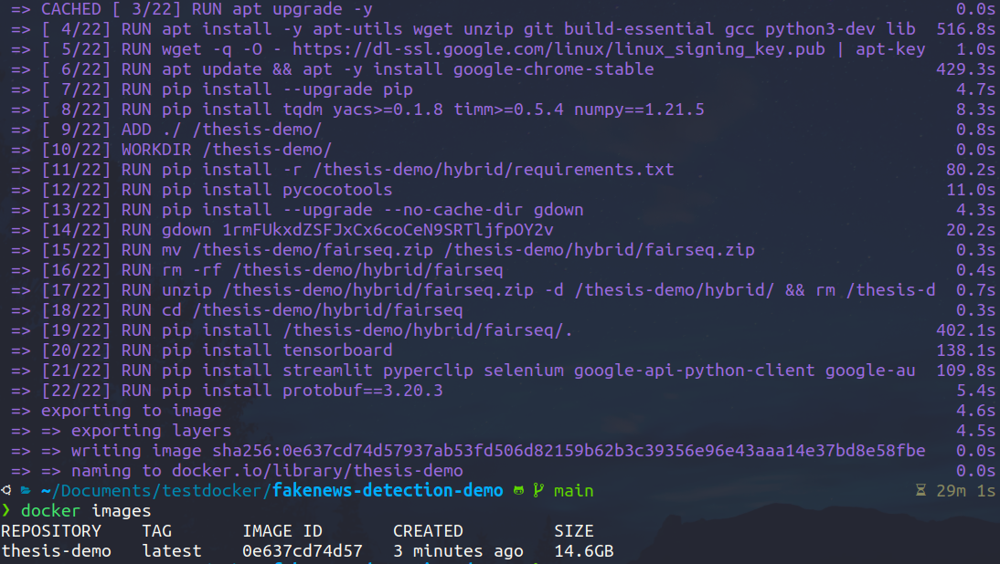
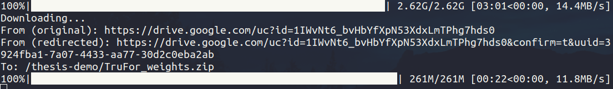

# Fake News Detection Demo

This repository contains a demo for analyzing and detecting fake news. The purpose of this README is to provide instructions on how to run the code and understand the project structure.

## Installation and Usage

1. Clone the repository to your local machine:

    ```bash
    git clone https://github.com/nbtin/fakenews-detection-demo.git
    ```

2. Navigate to the project directory:

    ```bash
    cd fakenews-detection-demo
    ```

3. Build docker image (that requires around 15.4 GB of disk space and takes around 10 minutes to build with a good internet connection ~ 2x MB/s):

    ```bash
    bash docker_build.sh
    ```
    

4. Run docker container:
    
    ```bash
    docker run --name=thesis-demo --runtime=nvidia --gpus all -v $(realpath ./):/thesis-demo/ thesis-demo bash
    
    ```
    This command will let you enter the container with the bash shell. You can run the following command to start the demo:
    
    ```bash
    streamlit run demo_docker.py
    ```

5. Wait for the demo to start and open the link in your browser. You are required to wait for the cheapfakes checkpoint to be downloaded (around 2.9GB) before the web ready.
    


And enjoys the demo!