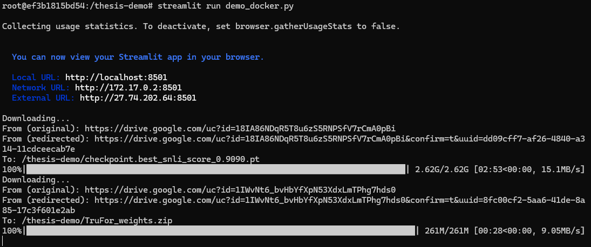

# Fake News Detection Demo

This repository contains a demo for analyzing and detecting fake news. The purpose of this README is to provide instructions on how to run the code and understand the project structure.

## Installation and Usage

### 1. Clone the repository to your local machine:

```bash
git clone https://github.com/nbtin/fakenews-detection-demo.git
```

### 2. Navigate to the project directory:

```bash
cd fakenews-detection-demo
```

### 3. Build docker image (that requires around 15.4 GB of disk space and takes around 10 minutes to build with a good internet connection ~ 2x MB/s):

```bash
bash docker_build.sh
```


### 4. Run docker container:
- Running on your local (**Linux**) machine with Nvidia GPU support:

    ```bash
    docker run -it --name=thesis-demo -p 8501:8501 --runtime=nvidia --gpus all -v $(realpath ./):/thesis-demo/ thesis-demo bash
    
    ```
- Running on your local (**Windows**) machine with Nvidia GPU support:

    ```bash
    docker run -it --name=thesis-demo -p 8501:8501 --gpus all -v .:/thesis-demo/ thesis-demo bash
    ```
- Running on a **server manually**:

    ```bash
    # remember to replace <your_port> with your actual port number you want to map to the container port 8501.
    docker run -it --name=thesis-demo -p your_port:8501 --gpus all -v $(realpath ./):/thesis-demo/ thesis-demo bash
    ```

    - This command will let you enter the container with the bash shell. 
    
    - You can run the following command to start the demo:
    
        ```bash
        streamlit run demo_docker.py
        ```
    - Then, go to server address with port `<your_port>` to see the demo.

- Running on a **server with a script**:

    ```bash
    sbatch run_demo.sh
    ```
    Then, go to server address with port 20333 to see the demo.
### 5. Additional steps for the first run:
Wait for the demo to start and open the link in your browser. You are required to wait for the cheapfakes and TruFor checkpoint to be downloaded in the first run (around 2.9GB) before the web ready.


### 6. Demo:
